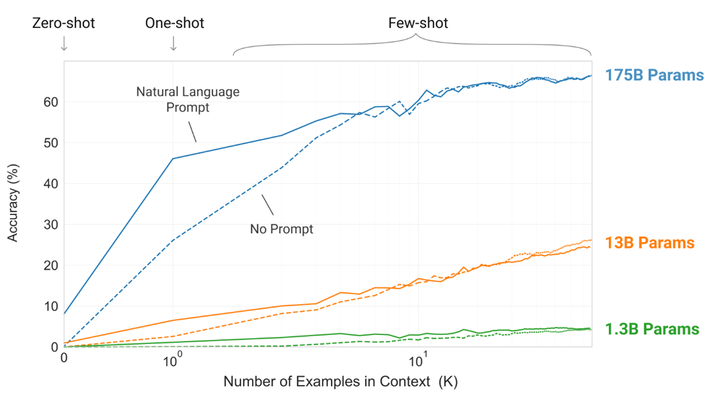
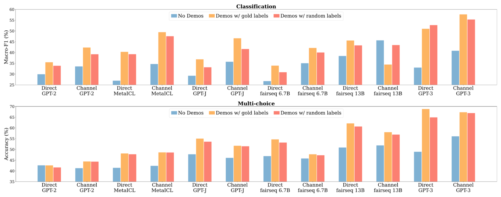

# Understanding In-Context Learning: The Chef's Approach

## Introduction


Imagine you're a chef who has been trained in various cooking techniques and recipes from around the world. One day, a customer comes in and asks for a dish you've never made before. Instead of going back to culinary school or spending weeks practicing this new recipe, you're handed a few example dishes with their recipes right there in the kitchen.

You quickly look over these examples, noticing:
- The ingredients used
- The cooking methods applied
- The presentation style

Drawing on your vast cooking knowledge and the patterns you've just observed, you're able to create a dish in the same style, even though you've never made it before.

This is essentially how In-Context Learning works for large language models:
1. The model, like our chef, has been pre-trained on a vast amount of data. ICL is enabled by the extensive pre-training of LLMs on vast language corpora, which provides them with strong priors and the flexibility to adapt to new tasks.
2. When given a new task along with a few examples (the 'context'), it can quickly adapt. Models learn from examples provided in the input, like our chef studying recipe cards.
3. It performs the task without needing to be retrained, just like our chef creating a new dish on the spot. This learning occurs during inference, not training - it's on-the-job learning for AI.

In-Context Learning (ICL) is a fascinating phenomenon observed in large language models (LLMs) such as GPT-3 and GPT-4. It's like giving our chef a new cookbook right before preparing a meal.

In the following sections, we'll explore the mechanics, types, and implications of In-Context Learning, drawing parallels to our culinary analogy to demystify this fascinating capability of modern AI.

*Reference: [What In-Context Learning "Learns" In-Context: Disentangling Task Recognition and Task Learning](https://arxiv.org/abs/2305.09731)*


### The Fundamental Idea:
Imagine whispering a few recipe tips to our chef just before they start cooking. Similarly, by providing a few task examples within the prompt, the model can:
- Understand the task requirements
- Recognize patterns and structures
- Apply this understanding to new, similar inputs

This ability showcases the remarkable flexibility and adaptability of modern language models. It's as if our AI chef can instantly master new cuisines just by glancing at a few example dishes!

### Why It Matters:
ICL represents a significant leap in AI capabilities:
- Models can tackle new tasks without extensive retraining
- It opens up possibilities for more dynamic and responsive AI systems
- This flexibility could lead to more versatile and user-friendly AI applications

## How In-Context Learning Works

In-Context Learning operates on a simple yet powerful principle, much like our chef quickly adapting to a new recipe. Let's break it down:

### The ICL Process:

1. **Input**: The model receives a prompt containing:
   - Demonstration examples (input-label pairs) - like sample recipes
   - A new input for which a response is needed - the new dish to prepare

2. **Processing**: The model uses its pre-trained knowledge along with the provided examples to understand the task at hand. It's like our chef combining their culinary expertise with the new recipe hints.

3. **Output**: Based on this understanding, the model generates an appropriate response for the new input. The chef serves up a dish in the style of the examples!

### Key Aspects:

- **No Parameter Updates**: Unlike traditional fine-tuning, ICL doesn't modify the model's weights. It's not learning new cooking techniques, just applying existing skills in a new way.

- **Pattern Recognition**: The model identifies patterns in the demonstration examples and applies them to new inputs. Our chef spots common ingredients or cooking methods across sample dishes.

- **Leveraging Pre-training**: ICL effectiveness relies on the model's vast pre-trained knowledge. The chef's years of experience are crucial for quickly adapting to new recipes.

### Example: The ICL Recipe

Let's look at an example of an ICL prompt:

```
Input: "The capital of France is Paris."
Output: "Correct"

Input: "The capital of Spain is Barcelona."
Output: "Incorrect"

Input: "The capital of Germany is Berlin."
Output: [The model generates a response here]
```

In this example, the model would likely respond with "Correct" for the last input, having learned the pattern from the previous examples. It's like our chef recognizing the correct pairing of countries and their capitals based on the given examples.


## Types of In-Context Learning

Just as our chef can adapt to new recipes with varying levels of guidance, In-Context Learning can be categorized into three main types based on the number of examples provided in the prompt:

### 1. Zero-shot Learning: The Intuitive Chef

- **What it is**: No examples are provided in the input context.
- **How it works**: The model relies entirely on its pre-trained knowledge to understand and perform the task.
- **Culinary analogy**: Our chef is asked to prepare a dish they've never made, with no recipe provided.
- **Example prompt**: 
  ```
  Translate the following sentence to French: 'Hello, how are you?'
  ```

### 2. One-shot Learning: The Quick Study

- **What it is**: A single example is provided in the input context.
- **How it works**: The model uses this one example to grasp the task and apply it to the new input.
- **Culinary analogy**: The chef is given one sample dish to taste before recreating it.
- **Example prompt**:
  ```
  English: Hello, how are you?
  French: Bonjour, comment allez-vous?

  Translate to French: Good morning, I'm fine.
  ```

### 3. Few-shot Learning: The Pattern Master

- **What it is**: Multiple examples (typically 2-5) are provided in the input context.
- **How it works**: The model can better understand the task pattern and nuances from these examples.
- **Culinary analogy**: The chef is shown a few variations of a dish, allowing them to grasp the core technique and flavor profile.
- **Why it's powerful**: Generally more effective for complex tasks or when higher accuracy is needed.
- **Example prompt**:
  ```
  English: Hello, how are you?
  French: Bonjour, comment allez-vous?

  English: I love pizza.
  French: J'aime la pizza.

  English: What's the weather like today?
  French: Quel temps fait-il aujourd'hui?

  Translate to French: I'm going to the park tomorrow.
  ```

### Comparing the Approaches

Each type has its own strengths and use cases, much like different levels of recipe guidance for our chef:

- **Zero-shot**: Best for simple, familiar tasks
- **One-shot**: Good for tasks with clear patterns
- **Few-shot**: Ideal for complex tasks or when precision is crucial

Few-shot learning often provides the best balance between context length and task performance for many applications, like giving our chef just enough examples to master a new cuisine.



*Reference: [Language Models are Few-Shot Learners](https://arxiv.org/abs/2005.14165)*

## Performance:



The performance of In-Context Learning, much like our chef's culinary creations, varies depending on several factors. Let's dive into the key ingredients that affect ICL's performance:

### 1. Comparing Learning Types

- **The Trend**: Generally, few-shot learning outperforms one-shot learning, which in turn outperforms zero-shot learning.
- **When It Matters**: This trend is particularly noticeable for complex tasks or those requiring specific formatting or style.
- **Culinary Analogy**: It's like comparing a chef's performance with no recipe, one example dish, or a full tasting menu as guidance.

### 2. Model Size: Kitchen Equipment Matters

- **Bigger is Better**: Larger models tend to perform better at ICL tasks.
- **Narrowing Gaps**: As model size increases, the performance difference between zero-shot, one-shot, and few-shot learning often shrinks. ICL effectiveness relies on the model's vast pre-trained knowledge.
- **Chef's Perspective**: It's like having a more experienced chef who can adapt quickly, regardless of how many example dishes they're shown.

### 3. Task Complexity: From Sandwiches to Soufflés

- **Simple Tasks**: Might show little difference between zero-shot and few-shot performance.
- **Complex Tasks**: Often benefit significantly from additional examples.
- **In the Kitchen**: Making a sandwich might not require examples, but a complex dessert benefits from step-by-step guidance.

### 4. Quality of Examples: Fresh Ingredients Make a Difference

- **High Impact**: ICL performance is highly dependent on the quality and relevance of the provided examples.
- **Diversity Wins**: Diverse and representative examples tend to lead to better performance.
- **Chef's Insight**: Just as high-quality, varied ingredients improve a dish, good examples enhance ICL performance.

### 5. Prompt Engineering: The Art of Recipe Writing

- **Formatting Matters**: How examples are presented can significantly impact performance.
- **Careful Design**: Well-crafted prompts can enhance ICL effectiveness.
- **Culinary Parallel**: It's like writing a clear, well-structured recipe that a chef can easily follow.

### 6. Limitations: Even Master Chefs Have Their Limits

- **Reasoning Challenges**: ICL may struggle with tasks requiring extensive reasoning or external knowledge.
- **Inconsistency**: Performance can vary, especially for edge cases or unusual inputs.
- **In the Kitchen**: Even a great chef might struggle with unfamiliar cuisines or extremely complex dishes.

### The Taste Test Results

While ICL has shown impressive results across various tasks, its performance can be unpredictable. It may not always match models specifically fine-tuned for a task, much like how a versatile chef might not always outperform a specialist in their signature dish.

*Reference: [Rethinking the Role of Demonstrations: What Makes In-Context Learning Work?](https://arxiv.org/abs/2202.12837)*

# The Dual View: A Comprehensive Perspective on In-Context Learning

## Introduction

Recent research proposes a novel "Dual View" to explain how In-Context Learning (ICL) works in large language models. This perspective offers valuable insights into the mechanisms behind ICL and its relationship to traditional fine-tuning methods.

## Key Concepts

### 1. ICL as Meta-Optimization

The Dual View suggests that ICL can be understood as a form of implicit optimization or "meta-optimization." In this framework:
- The pretrained model acts as a "meta-optimizer"
- It produces "meta-gradients" from demonstration examples through forward computation
- These meta-gradients are applied to the model via attention, creating an "ICL model"

### 2. Attention-Gradient Duality

A crucial insight of this theory is that Transformer attention has a dual form analogous to gradient descent optimization. This duality provides a theoretical foundation for understanding ICL in terms of well-established optimization techniques.

### 3. Comparison to Fine-tuning

The Dual View draws an interesting parallel between ICL and traditional fine-tuning:
- ICL produces meta-gradients via forward computation
- Fine-tuning computes gradients via backpropagation
- Both methods apply gradients to update the model, albeit in different ways

This perspective frames ICL as a form of dynamic, implicit fine-tuning during inference.

## Mathematical Foundations

### Dual Form of Transformer Attention and Gradient Descent

For a linear layer optimized by gradient descent:

```
F(x) = (W0 + ΔW)x
```

Where $W_0$ is the initial weight matrix, $\Delta W$ is the update matrix, and $\mathbf{x}$ is the input.

The update matrix $\Delta W$ is computed as:

```
ΔW = ∑i ei ⊗ xi'
```

Where $\mathbf{e}_i$ are error signals and $\mathbf{x}'_i$ are historic input representations.

Combining these equations, we get:

```
F(x) = W0x + ∑i ei(xi'x) = W0x + LinearAttn(E, X', x)
```

This shows the dual form between linear layers optimized by gradient descent and linear attention.

### Transformer Attention as Meta-Optimization

For in-context learning (ICL), the attention in a Transformer can be approximated as:

```
FICL(q) ≈ WV[X';X](WK[X';X])Tq
```

This can be rewritten as:

```
FICL(q) = WZSLq + ∑i ((WVxi') ⊗ (WKxi'))q
```

Where $W_{\text{ZSL}} = W_VX(W_KX)^T$ represents the zero-shot learning parameters.

### Meta-Gradients in In-Context Learning

The researchers interpret $W_V X'$ as meta-gradients. These meta-gradients are used to compute the update matrix $\Delta W_{\text{ICL}}$:

```
ΔWICL = ∑i ((WVxi') ⊗ (WKxi'))
```

This update is applied to the original model parameters through attention, effectively performing implicit fine-tuning.

## Meta-Optimization in In-Context Learning

The meta-optimization process in ICL involves several key aspects:

1. **Learning to Learn**: The model uses demonstration examples to generate meta-gradients, which guide it in adapting to new tasks quickly.

2. **Meta-Gradient Generation**: The model analyzes patterns and relationships in the provided examples and generates meta-gradients that represent how to adjust its behavior for the given task.

3. **Application through Transformer Attention**: Instead of directly updating model parameters, these meta-gradients are applied through the attention mechanism of the transformer.

4. **Implicit Gradient Descent**: The process can be viewed as an implicit form of gradient descent, with the attention mechanism effectively performing a one-step gradient update for the specific task.

5. **Efficiency**: This approach allows for rapid adaptation to new tasks without the need for explicit fine-tuning, leveraging the model's pre-trained knowledge and architecture.

6. **Limitations**: The effectiveness of this meta-optimization is constrained by the model's pre-existing knowledge and the quality of the provided examples.

## Momentum-Based Attention

Inspired by gradient descent with momentum, the researchers propose a momentum-based attention mechanism:

```
MoAttn(V, K, qt) = Attn(V, K, qt) + ∑i=1t-1 ηt-ivi
```

Where $\eta$ is a scalar between 0 and 1, and $\mathbf{v}_i$ are attention value vectors.

This extension further demonstrates how optimization techniques can be applied to improve attention mechanisms.

### 6. Interpretation

- This derivation shows that attention computation in transformers is analogous to weight adjustments in a linear layer through gradient descent.
- ICL can be viewed as an implicit form of optimization, similar to one step of gradient descent.

### Summary

The Dual View posits that in-context learning in GPT models can be understood as a meta-optimization process analogous to gradient descent. This perspective explains how GPT models adapt to new tasks through implicit fine-tuning, leveraging the attention mechanism to apply meta-gradients derived from demonstration examples. The duality with gradient descent offers a theoretical foundation for this understanding, supported by empirical evidence and enhanced by innovations like momentum-based attention.

## Implications and Future Directions

The Dual View offers a theoretical framework for understanding ICL, potentially leading to improvements in model design and performance. Some potential areas for future research include:

1. Developing new attention mechanisms inspired by optimization techniques.
2. Exploring ways to enhance ICL performance based on insights from the Dual View.
3. Investigating the limitations of ICL through this theoretical lens and identifying scenarios where traditional fine-tuning might still be preferable.
4. Studying the relationship between model size, pre-training data, and ICL effectiveness through the lens of meta-optimization.

## References

For a more detailed explanation of the Dual View concept, please refer to the original paper:

[Why Can GPT Learn In-Context? Language Models Implicitly Perform Gradient Descent as Meta-Optimizers](https://arxiv.org/abs/2202.12837)

---

This README provides a comprehensive overview of the Dual View concept in in-context learning. For more detailed information, including additional mathematical derivations and empirical evidence, please refer to the full research paper.


