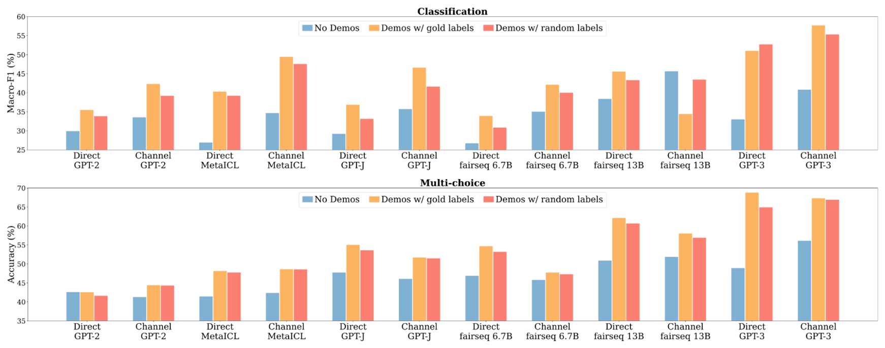

# Understanding In-Context Learning: The Chef's Approach

## Introduction

Imagine you're a chef who has been trained in various cooking techniques and recipes from around the world. One day, a customer comes in and asks for a dish you've never made before. Instead of going back to culinary school or spending weeks practicing this new recipe, you're handed a few example dishes with their recipes right there in the kitchen.

You quickly look over these examples, noticing:
- The ingredients used
- The cooking methods applied
- The presentation style

Drawing on your vast cooking knowledge and the patterns you've just observed, you're able to create a dish in the same style, even though you've never made it before.

This is essentially how In-Context Learning works for large language models:
1. The model, like our chef, has been pre-trained on a vast amount of data.
2. When given a new task along with a few examples (the 'context'), it can quickly adapt.
3. It performs the task without needing to be retrained, just like our chef creating a new dish on the spot.

In the following sections, we'll explore the mechanics, types, and implications of In-Context Learning, drawing parallels to our culinary analogy to demystify this fascinating capability of modern AI.

## Introduction to In-Context Learning

In-Context Learning (ICL) is a fascinating phenomenon observed in large language models (LLMs) such as GPT-3 and GPT-4. It's like giving our chef a new cookbook right before preparing a meal.

### Key Points:
1. **Advanced LLM Capability**: ICL is a superpower of cutting-edge language models.
2. **Context-Based Learning**: Models learn from examples provided in the input, like our chef studying recipe cards.
3. **Real-Time Adaptation**: This learning occurs during inference, not training - it's on-the-job learning for AI!

### The Fundamental Idea:
Imagine whispering a few recipe tips to our chef just before they start cooking. Similarly, by providing a few task examples within the prompt, the model can:
- Understand the task requirements
- Recognize patterns and structures
- Apply this understanding to new, similar inputs

This ability showcases the remarkable flexibility and adaptability of modern language models. It's as if our AI chef can instantly master new cuisines just by glancing at a few example dishes!

### Why It Matters:
ICL represents a significant leap in AI capabilities:
- Models can tackle new tasks without extensive retraining
- It opens up possibilities for more dynamic and responsive AI systems
- This flexibility could lead to more versatile and user-friendly AI applications


Let's reformat and enhance this section to match the style of the example:

## How In-Context Learning Works

In-Context Learning operates on a simple yet powerful principle, much like our chef quickly adapting to a new recipe. Let's break it down:

### The ICL Process:

1. **Input**: The model receives a prompt containing:
   - Demonstration examples (input-label pairs) - like sample recipes
   - A new input for which a response is needed - the new dish to prepare

2. **Processing**: The model uses its pre-trained knowledge along with the provided examples to understand the task at hand. It's like our chef combining their culinary expertise with the new recipe hints.

3. **Output**: Based on this understanding, the model generates an appropriate response for the new input. The chef serves up a dish in the style of the examples!

### Key Aspects:

- **No Parameter Updates**: Unlike traditional fine-tuning, ICL doesn't modify the model's weights. It's not learning new cooking techniques, just applying existing skills in a new way.

- **Pattern Recognition**: The model identifies patterns in the demonstration examples and applies them to new inputs. Our chef spots common ingredients or cooking methods across sample dishes.

- **Leveraging Pre-training**: ICL effectiveness relies on the model's vast pre-trained knowledge. The chef's years of experience are crucial for quickly adapting to new recipes.

### Example: The ICL Recipe

Let's look at an example of an ICL prompt:

```
Input: "The capital of France is Paris."
Output: "Correct"

Input: "The capital of Spain is Barcelona."
Output: "Incorrect"

Input: "The capital of Germany is Berlin."
Output: [The model generates a response here]
```

In this example, the model would likely respond with "Correct" for the last input, having learned the pattern from the previous examples. It's like our chef recognizing the correct pairing of countries and their capitals based on the given examples.


## Types of In-Context Learning

Just as our chef can adapt to new recipes with varying levels of guidance, In-Context Learning can be categorized into three main types based on the number of examples provided in the prompt:

### 1. Zero-shot Learning: The Intuitive Chef

- **What it is**: No examples are provided in the input context.
- **How it works**: The model relies entirely on its pre-trained knowledge to understand and perform the task.
- **Culinary analogy**: Our chef is asked to prepare a dish they've never made, with no recipe provided.
- **Example prompt**: 
  ```
  Translate the following sentence to French: 'Hello, how are you?'
  ```

### 2. One-shot Learning: The Quick Study

- **What it is**: A single example is provided in the input context.
- **How it works**: The model uses this one example to grasp the task and apply it to the new input.
- **Culinary analogy**: The chef is given one sample dish to taste before recreating it.
- **Example prompt**:
  ```
  English: Hello, how are you?
  French: Bonjour, comment allez-vous?

  Translate to French: Good morning, I'm fine.
  ```

### 3. Few-shot Learning: The Pattern Master

- **What it is**: Multiple examples (typically 2-5) are provided in the input context.
- **How it works**: The model can better understand the task pattern and nuances from these examples.
- **Culinary analogy**: The chef is shown a few variations of a dish, allowing them to grasp the core technique and flavor profile.
- **Why it's powerful**: Generally more effective for complex tasks or when higher accuracy is needed.
- **Example prompt**:
  ```
  English: Hello, how are you?
  French: Bonjour, comment allez-vous?

  English: I love pizza.
  French: J'aime la pizza.

  English: What's the weather like today?
  French: Quel temps fait-il aujourd'hui?

  Translate to French: I'm going to the park tomorrow.
  ```

### Comparing the Approaches

Each type has its own strengths and use cases, much like different levels of recipe guidance for our chef:

- **Zero-shot**: Best for simple, familiar tasks
- **One-shot**: Good for tasks with clear patterns
- **Few-shot**: Ideal for complex tasks or when precision is crucial

Few-shot learning often provides the best balance between context length and task performance for many applications, like giving our chef just enough examples to master a new cuisine.


*Source: [Language Models are Few-Shot Learners](https://arxiv.org/abs/2005.14165)*


Let's reformat and enhance this section to match the style of the example:

## Performance: Tasting the AI-Cooked Dishes

The performance of In-Context Learning, much like our chef's culinary creations, varies depending on several factors. Let's dive into the key ingredients that affect ICL's performance:

### 1. Comparing Learning Types: From Quick Bites to Full Courses

- **The Trend**: Generally, few-shot learning outperforms one-shot learning, which in turn outperforms zero-shot learning.
- **When It Matters**: This trend is particularly noticeable for complex tasks or those requiring specific formatting or style.
- **Culinary Analogy**: It's like comparing a chef's performance with no recipe, one example dish, or a full tasting menu as guidance.

### 2. Model Size: Kitchen Equipment Matters

- **Bigger is Better**: Larger models tend to perform better at ICL tasks.
- **Narrowing Gaps**: As model size increases, the performance difference between zero-shot, one-shot, and few-shot learning often shrinks.
- **Chef's Perspective**: It's like having a more experienced chef who can adapt quickly, regardless of how many example dishes they're shown.

### 3. Task Complexity: From Sandwiches to Soufflés

- **Simple Tasks**: Might show little difference between zero-shot and few-shot performance.
- **Complex Tasks**: Often benefit significantly from additional examples.
- **In the Kitchen**: Making a sandwich might not require examples, but a complex dessert benefits from step-by-step guidance.

### 4. Quality of Examples: Fresh Ingredients Make a Difference

- **High Impact**: ICL performance is highly dependent on the quality and relevance of the provided examples.
- **Diversity Wins**: Diverse and representative examples tend to lead to better performance.
- **Chef's Insight**: Just as high-quality, varied ingredients improve a dish, good examples enhance ICL performance.

### 5. Prompt Engineering: The Art of Recipe Writing

- **Formatting Matters**: How examples are presented can significantly impact performance.
- **Careful Design**: Well-crafted prompts can enhance ICL effectiveness.
- **Culinary Parallel**: It's like writing a clear, well-structured recipe that a chef can easily follow.

### 6. Limitations: Even Master Chefs Have Their Limits

- **Reasoning Challenges**: ICL may struggle with tasks requiring extensive reasoning or external knowledge.
- **Inconsistency**: Performance can vary, especially for edge cases or unusual inputs.
- **In the Kitchen**: Even a great chef might struggle with unfamiliar cuisines or extremely complex dishes.

### The Taste Test Results

While ICL has shown impressive results across various tasks, its performance can be unpredictable. It may not always match models specifically fine-tuned for a task, much like how a versatile chef might not always outperform a specialist in their signature dish.



*Source: [Rethinking the Role of Demonstrations: What Makes In-Context Learning Work?](https://arxiv.org/abs/2202.12837)*


# Understanding In-Context Learning: The Dual View Approach

## What is In-Context Learning?

In-context learning (ICL) is a remarkable ability of large language models like GPT to perform new tasks without parameter updates, using only a few examples provided in the input prompt.

## The Dual View: A New Perspective on ICL

Recent research proposes a novel "Dual View" to explain how ICL works:

1. **ICL as Meta-Optimization**: The paper suggests viewing ICL as a form of implicit optimization or "meta-optimization".

2. **Attention-Gradient Duality**: A key insight is that Transformer attention has a dual form analogous to gradient descent optimization.

3. **ICL Process**:
   - The pretrained model acts as a "meta-optimizer"
   - It produces "meta-gradients" from demonstration examples through forward computation
   - These meta-gradients are applied to the model via attention, creating an "ICL model"

4. **Dual to Finetuning**:
   - ICL: Produces meta-gradients via forward computation
   - Finetuning: Computes gradients via backpropagation
   - Both apply gradients to update the model

5. **Implicit Finetuning**: This perspective frames ICL as a form of dynamic, implicit finetuning during inference.

## Mathematical Intuition

The core idea can be expressed mathematically:

1. Attention in Transformers: 
   ```
   F_ICL(q) = Attn(V, K, q) = Wᵥ[X'; X] softmax((Wₖ[X'; X])ᵀq / √d)
   ```

2. Approximated linear form:
   ```
   F̃_ICL(q) ≈ W_ZSL q + ΔW_ICL q
   ```
   Where W_ZSL represents "zero-shot learning" parameters and ΔW_ICL represents ICL updates.

3. Similarly for finetuning:
   ```
   F̃_FT(q) = (W_ZSL + ΔW_FT)q
   ```

This formulation shows how both ICL and finetuning can be viewed as applying updates to a base model.

## Implications

This Dual View offers a theoretical framework for understanding ICL, potentially leading to improvements in model design and performance. The authors provide empirical evidence supporting this perspective and even propose a "momentum-based attention" mechanism inspired by this understanding.


Certainly! I'll rewrite these sections without the cooking and chef analogies, focusing on a more direct explanation of the concepts:

## 5. Meta-Optimization in In-Context Learning

Meta-optimization in In-Context Learning refers to the model's ability to "learn how to learn." This process involves several key aspects:

### 1. Learning to Learn

- The model uses demonstration examples to generate meta-gradients.
- These meta-gradients guide the model in adapting to new tasks quickly.

### 2. Meta-Gradient Generation

- The model analyzes patterns and relationships in the provided examples.
- It generates meta-gradients that represent how to adjust its behavior for the given task.

### 3. Application through Transformer Attention

- Instead of directly updating model parameters, these meta-gradients are applied through the attention mechanism of the transformer.
- This allows for task-specific adaptations without changing the underlying model weights.

### 4. Implicit Gradient Descent

- The process can be viewed as an implicit form of gradient descent.
- The attention mechanism effectively performs a one-step gradient update for the specific task.

### 5. Efficiency

- This approach allows for rapid adaptation to new tasks without the need for explicit fine-tuning.
- It leverages the model's pre-trained knowledge and architecture to perform task-specific optimizations on the fly.

### 6. Limitations

- The effectiveness of this meta-optimization is constrained by the model's pre-existing knowledge and the quality of the provided examples.
- It may not be as effective as traditional fine-tuning for highly specialized or complex tasks.

This meta-optimization perspective helps explain how large language models can adapt to new tasks so quickly and effectively through In-Context Learning.

## 6. The Dual View Concept

The Dual View Concept provides a theoretical framework for understanding In-Context Learning by drawing parallels between ICL and traditional gradient descent optimization. This concept involves several key components:


### 1. Comparison of ICL and Fine-tuning

- Fine-tuning: Explicitly updates model parameters through backpropagation.
- ICL: Implicitly adapts model behavior without changing parameters.

### 2. Mathematical Derivation

- Starts with a linear layer optimized by gradient descent: F(x) = (W₀ + ΔW)x
- ΔW represents weight adjustments: ΔW = Σᵢ (eᵢ ⊗ x'ᵢ)
- eᵢ: error signals, x'ᵢ: previous input representations

### 3. Linking to Linear Attention

- The computation of outer products and their sum is interpreted as a linear attention operation:
  F(x) = W₀x + LinearAttn(E, X', x)

### 4. Application to Transformer Attention

- Attention formula: Attn(Q, K, V) = softmax(QᵀK / √dₖ)V
- Approximated as linear attention: Attn(Q, K, V) ≈ QᵀK

### 5. Demonstrating Duality

- ICL function: F_ICL(q) = W_V(X';X)(W_K(X';X))ᵀq
- Decomposed as: F_ICL(q) = W_ZSL q + ΔW_ICL q
- W_ZSL: zero-shot learning component
- ΔW_ICL: in-context learning adjustments

### 6. Interpretation

- This derivation shows that attention computation in transformers is analogous to weight adjustments in a linear layer through gradient descent.
- ICL can be viewed as an implicit form of optimization, similar to one step of gradient descent.

### Summary

The Dual View posits that in-context learning in GPT models can be understood as a meta-optimization process analogous to gradient descent. This perspective explains how GPT models adapt to new tasks through implicit fine-tuning, leveraging the attention mechanism to apply meta-gradients derived from demonstration examples. The duality with gradient descent offers a theoretical foundation for this understanding, supported by empirical evidence and enhanced by innovations like momentum-based attention.

This theoretical framework provides insights into why large language models can perform In-Context Learning, linking it to well-understood optimization techniques and potentially leading to improvements in model design and performance.


Introduction:

Imagine you're a chef who has been trained in various cooking techniques and recipes from around the world. One day, a customer comes in and asks for a dish you've never made before. Instead of going back to culinary school or spending weeks practicing this new recipe, you're handed a few example dishes with their recipes right there in the kitchen.
You quickly look over these examples, noticing the ingredients used, the cooking methods applied, and the presentation style. Drawing on your vast cooking knowledge and the patterns you've just observed, you're able to create a dish in the same style, even though you've never made it before.
This is essentially how In-Context Learning works for large language models. The model, like our chef, has been pre-trained on a vast amount of data. When given a new task along with a few examples (the 'context'), it can quickly adapt and perform the task without needing to be retrained.

Overview:
Introduction to In-Context Learning

A phenomenon observed in large language models (LLMs) like GPT-3 or GPT-4
Models learn from examples within the input context


How In-Context Learning Works

Models receive demonstration examples (input-label pairs)
Use these examples to interpret new inputs in the context
No changes to model parameters required


Types of In-Context Learning

Zero-shot: No examples in the input context
One-shot: One example in the input context
Few-shot: Multiple examples in the input context


Performance

Comparison of zero-shot, one-shot, and few-shot learning performance
Discussion of factors affecting ICL performance


Meta-Optimization

The concept of "learning to learn"
How models use demonstration examples to generate meta-gradients
Application of these gradients through transformer attention


Dual View Concept

Comparison of traditional fine-tuning with ICL
Mathematical derivation showing the duality between gradient descent and attention mechanisms


Advantages of In-Context Learning

Flexibility in adapting to new tasks
Efficiency (no retraining required)
Quick adaptability to specific requirements


Challenges and Limitations

Importance of good demonstration examples
Performance dependency on model size and parameters
Need for further research

---

1. Introduction to In-Context Learning

In-Context Learning (ICL) is a fascinating phenomenon observed in large language models (LLMs) such as GPT-3 and GPT-4. At its core, ICL allows these models to learn and adapt to new tasks without requiring any changes to their underlying parameters.

Key points:
- ICL is a capability of advanced LLMs
- It enables models to learn from examples provided within the input context
- This learning happens in real-time during inference, not during training

The fundamental idea behind ICL is that by providing a few examples of a task within the prompt, the model can understand and perform similar tasks on new inputs. This ability showcases the flexibility and adaptability of modern language models.


2. How In-Context Learning Works

In-Context Learning operates on a simple yet powerful principle:

    1. Input: The model receives a prompt containing:
    - Demonstration examples (input-label pairs)
    - A new input for which a response is needed

    2. Processing: The model uses its pre-trained knowledge along with the provided examples to understand the task at hand.

    3. Output: Based on this understanding, the model generates an appropriate response for the new input.

Key aspects:
- No parameter updates: Unlike traditional fine-tuning, ICL doesn't modify the model's weights.
- Pattern recognition: The model identifies patterns in the demonstration examples and applies them to new inputs.
- Leveraging pre-training: ICL effectiveness relies on the model's vast pre-trained knowledge.

Example structure of an ICL prompt:
```
Input: "The capital of France is Paris."
Output: "Correct"

Input: "The capital of Spain is Barcelona."
Output: "Incorrect"

Input: "The capital of Germany is Berlin."
Output: [The model generates a response here]
```

In this example, the model would likely respond with "Correct" for the last input, having learned the pattern from the previous examples.


3. Types of In-Context Learning

In-Context Learning can be categorized into three main types based on the number of examples provided in the prompt:

    1. Zero-shot Learning:
    - No examples are provided in the input context.
    - The model relies entirely on its pre-trained knowledge to understand and perform the task.
    - Example prompt: "Translate the following sentence to French: 'Hello, how are you?'"

    2. One-shot Learning:
    - A single example is provided in the input context.
    - The model uses this one example to grasp the task and apply it to the new input.
    - Example prompt:
        ```
        English: Hello, how are you?
        French: Bonjour, comment allez-vous?

        Translate to French: Good morning, I'm fine.
        ```

    3. Few-shot Learning:
    - Multiple examples (typically 2-5) are provided in the input context.
    - The model can better understand the task pattern and nuances from these examples.
    - Generally more effective for complex tasks or when higher accuracy is needed.
    - Example prompt:
        ```
        English: Hello, how are you?
        French: Bonjour, comment allez-vous?

        English: I love pizza.
        French: J'aime la pizza.

        English: What's the weather like today?
        French: Quel temps fait-il aujourd'hui?

        Translate to French: I'm going to the park tomorrow.
        ```

Each type has its own strengths and use cases, with few-shot learning often providing the best balance between context length and task performance for many applications.


Source: [Language Models are Few-Shot Learners](https://arxiv.org/abs/2005.14165) 


4. Performance

The performance of In-Context Learning varies depending on several factors, including the model size, the complexity of the task, and the number of examples provided. Here are some key points regarding ICL performance:

    1. Comparison across learning types:
    - Generally, few-shot learning outperforms one-shot learning, which in turn outperforms zero-shot learning.
    - This trend is particularly noticeable for more complex tasks or tasks that require specific formatting or style.

    2. Scaling with model size:
    - Larger models tend to perform better at ICL tasks.
    - As model size increases, the gap between zero-shot, one-shot, and few-shot performance often narrows.

    3. Task dependency:
    - Simple tasks might show little difference between zero-shot and few-shot performance.
    - More complex tasks often benefit significantly from additional examples.

    4. Quality of examples:
    - The performance of ICL is highly dependent on the quality and relevance of the provided examples.
    - Diverse and representative examples tend to lead to better performance.

    5. Prompt engineering:
    - The way examples are formatted and presented can significantly impact performance.
    - Careful prompt design can enhance ICL effectiveness.

    6. Limitations:
    - ICL may struggle with tasks that require extensive reasoning or access to external knowledge not covered in the training data.
    - Performance can be inconsistent, especially for edge cases or inputs significantly different from the provided examples.

It's important to note that while ICL has shown impressive results across various tasks, its performance can still be unpredictable and may not always match that of models specifically fine-tuned for a task.


Source: [Rethinking the Role of Demonstrations: What Makes In-Context Learning Work?](https://arxiv.org/abs/2202.12837) 


5. Meta-Optimization

The concept of meta-optimization in In-Context Learning can be understood as the model's ability to "learn how to learn." This process involves several key aspects:

    1. "Learning to learn":
    - The model uses demonstration examples to generate meta-gradients.
    - These meta-gradients guide the model in adapting to new tasks quickly.

    2. Meta-gradient generation:
    - The model analyzes the patterns and relationships in the provided examples.
    - It then generates meta-gradients that represent how to adjust its behavior for the given task.

    3. Application through transformer attention:
    - Instead of directly updating model parameters, these meta-gradients are applied through the attention mechanism of the transformer.
    - This allows for task-specific adaptations without changing the underlying model weights.

    4. Implicit gradient descent:
    - The process can be viewed as an implicit form of gradient descent.
    - The attention mechanism effectively performs a one-step gradient update for the specific task.

    5. Efficiency:
    - This approach allows for rapid adaptation to new tasks without the need for explicit fine-tuning.
    - It leverages the model's pre-trained knowledge and architecture to perform task-specific optimizations on the fly.

    6. Limitations:
    - The effectiveness of this meta-optimization is constrained by the model's pre-existing knowledge and the quality of the provided examples.
    - It may not be as effective as traditional fine-tuning for highly specialized or complex tasks.

This meta-optimization perspective helps explain how large language models can adapt to new tasks so quickly and effectively through In-Context Learning.


6. Dual View Concept

The Dual View Concept provides a theoretical framework for understanding In-Context Learning by drawing parallels between ICL and traditional gradient descent optimization. This concept involves several key components:


1. Comparison of ICL and Fine-tuning:
   - Fine-tuning: Explicitly updates model parameters through backpropagation.
   - ICL: Implicitly adapts model behavior without changing parameters.

2. Mathematical Derivation:
   - Starts with a linear layer optimized by gradient descent: F(x) = (W₀ + ΔW)x
   - ΔW represents weight adjustments: ΔW = Σᵢ (eᵢ ⊗ x'ᵢ)
   - eᵢ: error signals, x'ᵢ: previous input representations

3. Linking to Linear Attention:
   - The computation of outer products and their sum is interpreted as a linear attention operation:
     F(x) = W₀x + LinearAttn(E, X', x)

4. Application to Transformer Attention:
   - Attention formula: Attn(Q, K, V) = softmax(QᵀK / √dₖ)V
   - Approximated as linear attention: Attn(Q, K, V) ≈ QᵀK

5. Demonstrating Duality:
   - ICL function: F_ICL(q) = W_V(X';X)(W_K(X';X))ᵀq
   - Decomposed as: F_ICL(q) = W_ZSL q + ΔW_ICL q
   - W_ZSL: zero-shot learning component
   - ΔW_ICL: in-context learning adjustments

6. Interpretation:
   - This derivation shows that attention computation in transformers is analogous to weight adjustments in a linear layer through gradient descent.
   - ICL can be viewed as an implicit form of optimization, similar to one step of gradient descent.

This dual view provides a theoretical underpinning for why large language models can perform In-Context Learning, linking it to well-understood optimization techniques.

----

Dual View Concept

The Dual View concept revolves around the idea that the mechanism behind in-context learning in GPT models can be understood through a duality with gradient descent optimization. This duality offers a novel perspective on how in-context learning functions similarly to explicit finetuning, albeit implicitly. Here are the key points that outline this concept:

    Meta-Optimization:
        In-Context Learning (ICL) is viewed as a form of meta-optimization. In this process, a pretrained GPT model acts as a meta-optimizer.
        The GPT model produces meta-gradients based on demonstration examples through forward computation.

    Implicit Finetuning:
        These meta-gradients are then applied to the original language model through attention mechanisms, essentially modifying the model's behavior without explicit parameter updates.
        This process is referred to as implicit finetuning because the model adapts to new tasks similarly to how it would with traditional finetuning but does so "in-context" without changing the underlying parameters directly.

    Dual Form:
        The core idea is that Transformer attention mechanisms can be understood in a form that is dual to gradient descent optimization.
        Transformer attention calculates updates in a manner that is analogous to how gradient descent computes parameter updates. Specifically, the attention to demonstration tokens results in modifications that can be interpreted as parameter updates (though not explicitly applied in the same way as traditional gradient descent).

    Comparison with Explicit Finetuning:
        The document compares ICL with explicit finetuning, highlighting several similarities:
            Both perform a form of gradient descent: ICL produces meta-gradients through forward computation, while finetuning uses back-propagated gradients.
            Both use the same training information (demonstration examples for ICL and training examples for finetuning).
            Both follow the same causal order of training examples.
            Both primarily affect the computation of attention keys and values.

    Empirical Evidence:
        Experimental results show that ICL and explicit finetuning exhibit similar behaviors across various tasks, supporting the understanding that ICL operates like implicit finetuning.
        Metrics such as the similarity of attention outputs and attention weights demonstrate that ICL modifies the model's behavior in ways comparable to explicit finetuning.

    Momentum-Based Attention:
        Inspired by the dual form between Transformer attention and gradient descent, the researchers propose a momentum-based attention mechanism, analogous to gradient descent with momentum.
        This approach shows improved performance, further validating the dual view concept.

Summary

The Dual View posits that in-context learning in GPT models can be understood as a meta-optimization process analogous to gradient descent. This perspective explains how GPT models adapt to new tasks through implicit finetuning, leveraging the attention mechanism to apply meta-gradients derived from demonstration examples. The duality with gradient descent offers a theoretical foundation for this understanding, supported by empirical evidence and enhanced by innovations like momentum-based attention.


----

𝐹(𝑥)=(𝑊_0+Δ𝑊)𝑥

For a linear layer: F(x) = (W₀ + ΔW)x


Δ𝑊= ∑_𝑖▒〖𝑒_𝑖⊗𝑥_𝑖^′ " " 〗

Dual Form of Attention and Linear Layers:

The paper starts by showing the dual form between linear layers optimized by gradient descent and linear attention.
For a linear layer: F(x) = (W₀ + ΔW)x
Where W₀ is the initial weight matrix and ΔW is the update.
ΔW is computed as: ΔW = Σᵢ eᵢ ⊗ x'ᵢ
Where eᵢ are error signals and x'ᵢ are historic inputs.
This can be rewritten as:
F(x) = W₀x + LinearAttn(E, X', x)
This shows the equivalence between gradient updates and a form of attention.

----


# Understanding In-Context Learning: The Dual View Approach

## What is In-Context Learning?

In-context learning (ICL) is a remarkable ability of large language models like GPT to perform new tasks without parameter updates, using only a few examples provided in the input prompt.

## The Dual View: A New Perspective on ICL

Recent research proposes a novel "Dual View" to explain how ICL works:

1. **ICL as Meta-Optimization**: The paper suggests viewing ICL as a form of implicit optimization or "meta-optimization".

2. **Attention-Gradient Duality**: A key insight is that Transformer attention has a dual form analogous to gradient descent optimization.

3. **ICL Process**:
   - The pretrained model acts as a "meta-optimizer"
   - It produces "meta-gradients" from demonstration examples through forward computation
   - These meta-gradients are applied to the model via attention, creating an "ICL model"

4. **Dual to Finetuning**:
   - ICL: Produces meta-gradients via forward computation
   - Finetuning: Computes gradients via backpropagation
   - Both apply gradients to update the model

5. **Implicit Finetuning**: This perspective frames ICL as a form of dynamic, implicit finetuning during inference.

## Mathematical Intuition

The core idea can be expressed mathematically:

1. Attention in Transformers: 
   ```
   F_ICL(q) = Attn(V, K, q) = Wᵥ[X'; X] softmax((Wₖ[X'; X])ᵀq / √d)
   ```

2. Approximated linear form:
   ```
   F̃_ICL(q) ≈ W_ZSL q + ΔW_ICL q
   ```
   Where W_ZSL represents "zero-shot learning" parameters and ΔW_ICL represents ICL updates.

3. Similarly for finetuning:
   ```
   F̃_FT(q) = (W_ZSL + ΔW_FT)q
   ```

This formulation shows how both ICL and finetuning can be viewed as applying updates to a base model.

## Implications

This Dual View offers a new theoretical framework for understanding ICL, potentially leading to improvements in model design and performance. The authors provide empirical evidence supporting this perspective and even propose a "momentum-based attention" mechanism inspired by this understanding.

---

This explanation provides a high-level overview of the Dual View concept, its mathematical intuition, and its implications for understanding in-context learning. It's suitable for a GitHub README, giving readers a quick grasp of the core ideas without diving too deeply into the mathematical details.


----

7. Advantages of In-Context Learning

In-Context Learning offers several significant advantages over traditional fine-tuning approaches:

1. Flexibility:
- Models can adapt to a wide range of new tasks without requiring task-specific training.
- This allows for rapid prototyping and experimentation with different tasks.

2. Efficiency:
- No additional training or fine-tuning is required, saving computational resources and time.
- The model can be applied to new tasks immediately, without the need for separate models for each task.

3. Quick Adaptability:
- ICL allows models to adjust to specific requirements or variations of a task in real-time.
- This is particularly useful for handling edge cases or unique user requests.

4. Preservation of General Knowledge:
- Unlike fine-tuning, which can lead to catastrophic forgetting, ICL maintains the model's broad knowledge base.
- The model can leverage its general knowledge while adapting to specific tasks.

5. Low Resource Requirement:
- ICL can be effective even with a small number of examples, making it useful in scenarios where large task-specific datasets are not available.

6. Dynamic Task Switching:
- Models can switch between different tasks within the same conversation or session, simply by changing the provided context.

7. Reduced Risk of Overfitting:
- Since the model parameters are not updated, there's less risk of overfitting to a specific task or dataset.

8. Ease of Use:
- ICL can be implemented through prompt engineering, making it accessible to users without deep machine learning expertise.

These advantages make In-Context Learning a powerful and versatile approach for deploying large language models across a variety of applications and use cases.


8. Challenges and Limitations

While In-Context Learning offers many advantages, it also comes with several challenges and limitations that are important to consider:

1. Quality of Demonstration Examples:
- The performance of ICL heavily depends on the quality and relevance of the provided examples.
- Poorly chosen examples can lead to suboptimal or incorrect outputs.

2. Context Length Limitations:
- Most models have a maximum context length, limiting the number of examples that can be included.
- This can be problematic for complex tasks that require many examples for accurate learning.

3. Inconsistency in Performance:
- ICL performance can be less consistent compared to fine-tuned models, especially for edge cases.
- Results may vary depending on the specific examples provided and their order.

4. Model Size Dependency:
- The effectiveness of ICL generally increases with model size.
- Smaller models may not perform ICL as effectively, limiting its applicability in resource-constrained environments.

5. Task Complexity:
- ICL may struggle with tasks that require extensive reasoning or access to knowledge not covered in the training data.
- Complex multi-step tasks can be challenging to demonstrate effectively within the context window.

6. Lack of Long-Term Learning:
- Unlike fine-tuning, ICL doesn't allow the model to permanently learn from new experiences.
- Each new interaction starts from the same baseline knowledge.

7. Potential for Misunderstanding:
- The model might misinterpret the task based on the provided examples, leading to incorrect generalizations.

8. Computational Overhead:
- While ICL doesn't require retraining, it does increase the input size and thus the computational cost at inference time.

9. Privacy Concerns:
- Sensitive information in demonstration examples could potentially be reflected in the model's outputs.

10. Need for Further Research:
    - The underlying mechanisms of ICL are not fully understood, and more research is needed to improve its reliability and effectiveness.

These challenges highlight the importance of careful implementation and consideration when using In-Context Learning, as well as the need for continued research and development in this field.


